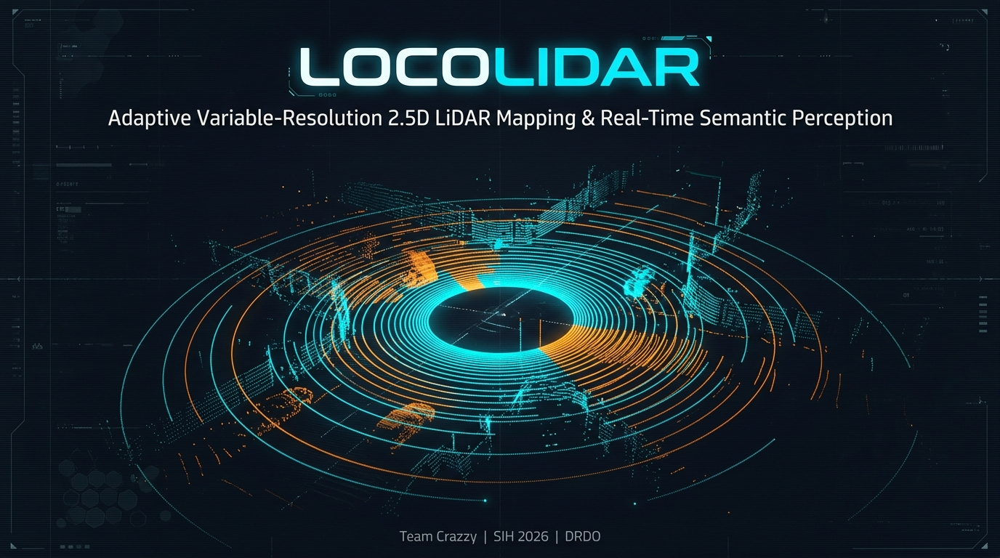
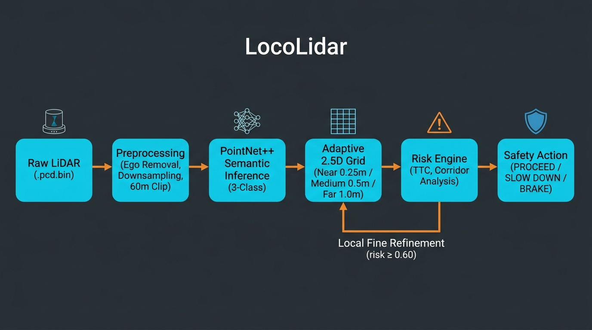
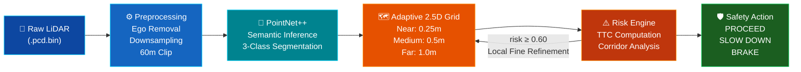
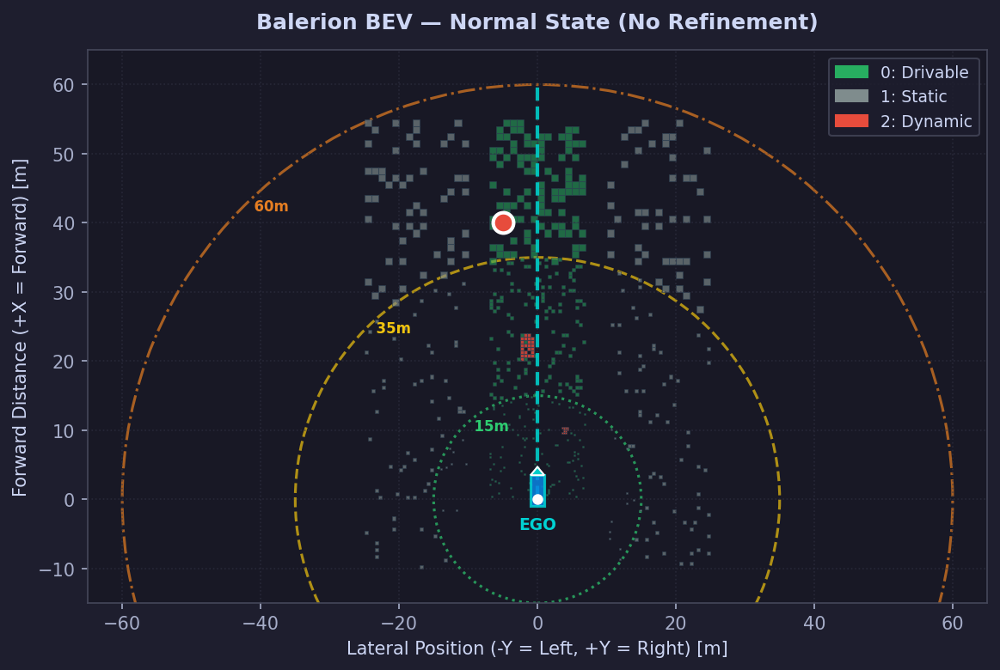
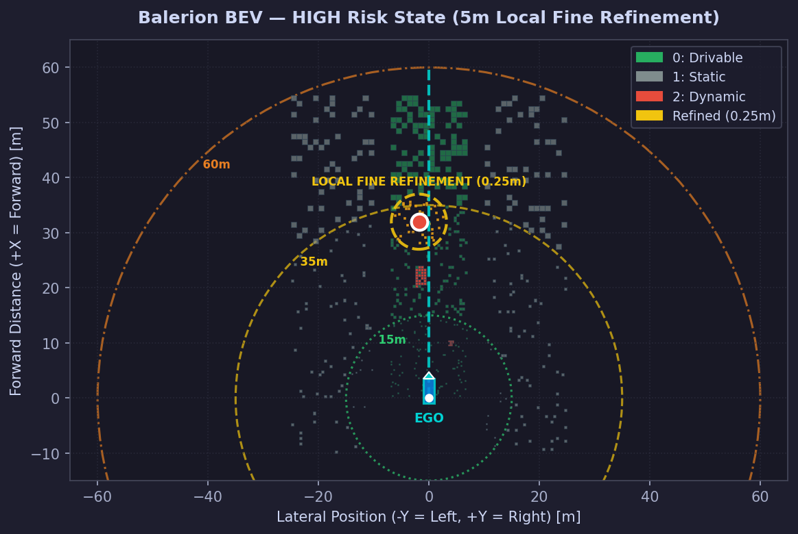
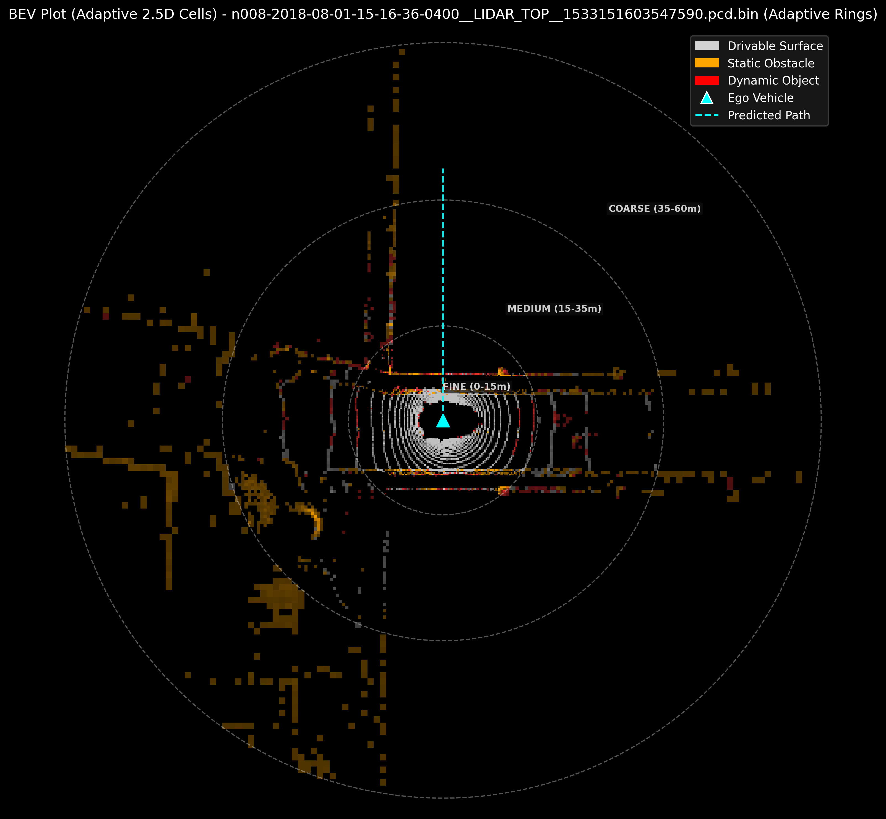
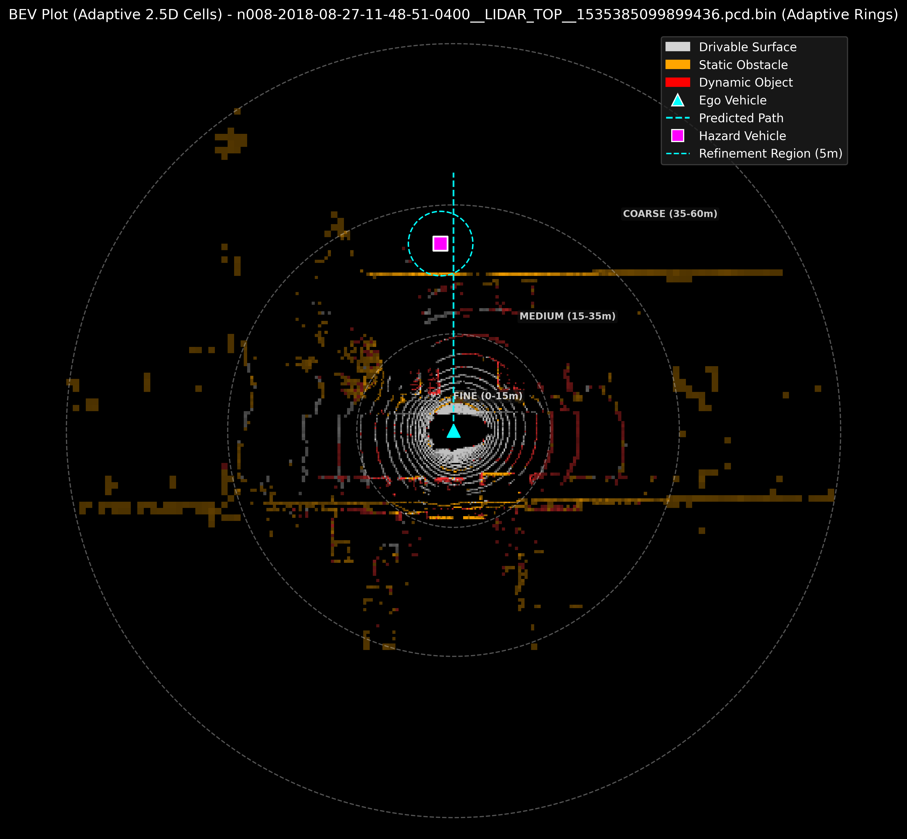

<p align="center">
  
</p>

<p align="center">
  <a href="#"></a>
  <a href="#"></a>
  <a href="#"></a>
  <a href="https://www.python.org/"></a>
  <a href="https://pytorch.org/"></a>
  <a href="https://opensource.org/licenses/MIT"></a>
  <a href="YOUR_VERCEL_URL_HERE"></a>
</p>

<p align="center">
  
</p>

<h3 align="center">
  <b>LocoLidar</b> — Adaptive Variable-Resolution 2.5D LiDAR Mapping<br/>& Real-Time Semantic Perception System
</h3>

<p align="center">
  An end-to-end pipeline that converts raw 3D LiDAR point clouds into adaptive-resolution 2.5D semantic maps<br/>
  with risk-reactive local refinement and autonomous safety decision-making.<br/><br/>
  <b>Team Crazzy</b> · Smart India Hackathon 2026 · DRDO
</p>

<p align="center">
  🔗 <b><a href="https://locolidar.vercel.app">Live Interactive Demo →</a></b>
</p>

---

<!-- ============================================================ -->
## 🧠 The Problem We Solve

Autonomous ground vehicles need to understand their 3D environment in real time. Current approaches force a tradeoff:

| | Full 3D Voxel Maps | Flat 2D Grids | **LocoLidar Adaptive 2.5D** |
|:---|:---|:---|:---|
| **Precision** | ✅ Full volumetric detail | ❌ Loses height data | ✅ Retains elevation + semantics |
| **Memory** | ❌ O(N³) — prohibitive | ✅ O(N²) — lightweight | ✅ O(N²) with adaptive savings |
| **Collision Safety** | ✅ Curbs, potholes, overhangs | ❌ Missed vertical obstacles | ✅ Height-aware near-field |
| **Compute** | ❌ GPU-heavy, latency-prone | ✅ Real-time feasible | ✅ Foveated — detail where it matters |
| **Edge Deployment** | ❌ Unsuitable for constrained HW | ✅ Feasible | ✅ Designed for power-constrained HW |

> **Our approach:** Allocate fine resolution (0.25m) in the near-field where collision risk is highest, medium (0.5m) at mid-range, and coarse (1.0m) at far range — mimicking how human vision prioritizes detail. When a threat is detected, the system dynamically refines resolution around the hazard.

---

<!-- ============================================================ -->
## 💡 Our Innovation

- **From-Scratch PointNet++** — Full set-abstraction + feature-propagation architecture implemented and trained end-to-end on real nuScenes LiDAR data. No pretrained off-the-shelf model dependency.
- **Foveated Adaptive Resolution** — Bio-inspired multi-ring grid that concentrates spatial detail near the ego vehicle, reducing cell count by **~18.3%** vs. uniform fine grids without losing near-field precision.
- **Risk-Reactive Local Refinement** — When the risk engine detects a closing threat (risk ≥ 0.60), the system automatically re-bins the local region at maximum resolution from raw source points.
- **Full Autonomy Loop** — End-to-end: raw `.pcd.bin` → preprocessing → semantic inference → adaptive 2.5D map → risk assessment → safety action (PROCEED / SLOW DOWN / BRAKE).

---

<!-- ============================================================ -->
## 🏗️ System Architecture

<p align="center">
  
</p>

<details>
<summary><b>📐 Architecture Diagram (Mermaid — click to expand)</b></summary>



</details>

---

<!-- ============================================================ -->
## 📊 Pipeline Deep Dive

| Stage | Input | Process | Output |
|:---:|:---|:---|:---|
| **1** | `.pcd.bin` raw LiDAR | Load binary point cloud | `(N, 5)` float32 array |
| **2** | Raw point cloud | Ego-vehicle point removal, spatial downsampling, 60m radial clip | Clean, normalized points |
| **3** | Clean points | PointNet++ forward pass — Set Abstraction → Feature Propagation → 3-class head | Per-point semantic labels |
| **4** | Labeled points | Adaptive radial binning: **Near** (0–15m, 0.25m), **Medium** (15–35m, 0.5m), **Far** (35–60m, 1.0m) | 2.5D cell grid with elevation + semantics |
| **5** | 2.5D grid + dynamics | Distance-based risk scoring, corridor analysis, TTC, 4-level escalation | Safety action + optional local refinement |

### 🎯 Semantic Classes

| Color | Class | ID | Description |
|:---:|:---|:---:|:---|
| 🟩 | **Drivable Surface** | 0 | Roads, traversable terrain |
| ⬜ | **Static Objects** | 1 | Buildings, sidewalks, barriers |
| 🟥 | **Dynamic Objects** | 2 | Vehicles, pedestrians, cyclists |

---

<!-- ============================================================ -->
## 📈 Benchmarks & Verified Results

The full pipeline has been validated end-to-end on **10 real LiDAR frames with 0 failures**.
All values below are **recomputed** from `evidence/current/metrics.json` — not self-reported claims.

| Metric | Value | Provenance |
|:---|:---|:---:|
| **Frames validated** | 10 / 10 (0 failures) | `recomputed` |
| **Avg input points per frame** | 32,768 | `recomputed` |
| **Avg points within 60m** | 32,509 | `recomputed` |
| **Avg adaptive 2.5D cells** | 4,029 | `recomputed` |
| **Avg uniform fine cells** | 4,936 | `recomputed` |
| **Adaptive cell-count reduction** | **18.31%** vs. uniform 0.25m grid | `recomputed` |
| **Mapping-only latency** | **180 ms/frame** (converter only, excl. inference) | `recomputed` |
| **PointNet++ validation accuracy** | **80.14%** (50 epochs, nuScenes) | `training_log` |
| **Frozen demo scenes** | 3 nuScenes sequences | `recomputed` |

> **⚠️ Transparency note:** The 18.31% reduction is an occupied-cell-count comparison, not a memory-bytes claim. Mapping latency excludes model inference, rendering, and I/O. See [`docs/METRIC_METHODOLOGY.md`](docs/METRIC_METHODOLOGY.md) for full provenance details.

### Adaptive Resolution Distribution

| Zone | Range | Cell Size | Cells (avg) |
|:---|:---|:---|:---:|
| **Near (Fine)** | 0 – 15m | 0.25 m | 2,532 |
| **Medium** | 15 – 35m | 0.50 m | 797 |
| **Far (Coarse)** | 35 – 60m | 1.00 m | 305 |

---

<!-- ============================================================ -->
## 🖼️ Visual Results

### Normal State — Adaptive Resolution Rings
The near-field has the highest cell density, with resolution coarsening progressively outward.

<p align="center">
  
</p>

### HIGH Risk State — Local Fine Refinement
When a dynamic object triggers risk ≥ 0.60, the system activates local 0.25m refinement around the hazard.

<p align="center">
  
</p>

### Full Adaptive 2.5D Cell Rendering with Rings
Complete cell-level rendering showing semantic labels overlaid on the adaptive grid structure.

<p align="center">
  
</p>

### Hazard Simulation — Vehicle Approaching Ego Path
Simulated hazard vehicle approaching the ego corridor with refinement region (cyan circle) activated.

<p align="center">
  
</p>

---

<!-- ============================================================ -->
## 🌍 Defence & Impact Applications

> Targeted at autonomous/semi-autonomous ground vehicle systems for defence and civilian dual-use.

| Domain | Application | LocoLidar Advantage |
|:---|:---|:---|
| 🪖 **Autonomous Military Vehicles** | Tactical perception in unstructured terrain | Height-aware near-field for IED/obstacle detection |
| 🛡️ **Border Surveillance Robots** | Continuous patrol with limited battery | 18%+ cell reduction enables longer operation |
| 🚁 **Disaster Response UAVs** | Rapid terrain assessment post-disaster | Lightweight compute fits constrained onboard HW |
| 🏭 **DRDO/IDEX Smart Vehicles** | Drop-in perception module for R&D platforms | Modular pipeline, MIT licensed |
| 🌾 **Agriculture & Logistics** | Autonomous navigation in semi-structured environments | Adaptive detail where obstacles cluster |

### Key Benefits

- **Safety:** Full-resolution perception exactly where collision risk is highest (near-field 0–15m).
- **Computational Efficiency:** 18.3%+ cell-count reduction enables perception on lighter, power-constrained onboard compute hardware.
- **Operational Endurance:** Lower memory footprint supports longer continuous operation without RAM saturation.
- **Extensibility:** The adaptive-resolution approach generalizes to any real-time 3D perception system — not LiDAR-specific.

---

<!-- ============================================================ -->
## 🛡️ Risk-Reactive Safety Pipeline

The system implements a **4-level risk escalation** with autonomous safety actions:

```
LOW [0, 0.35)  →  PROCEED        — Normal driving, no intervention
MEDIUM [0.35, 0.60)  →  PROCEED  — Elevated awareness, monitoring
HIGH [0.60, 0.85)  →  SLOW DOWN  — Active threat, reduce speed + LOCAL REFINEMENT ACTIVATED
CRITICAL [0.85, 1.0]  →  BRAKE   — Imminent collision, emergency stop
```

**How it works:**
1. **Distance-based risk:** `base_risk = clamp(1 - distance/50, 0, 1)`
2. **Corridor analysis:** Objects inside the ego corridor (±2.5m lateral, 0–40m forward) receive elevated risk
3. **Closing speed factor:** Lateral and longitudinal approach velocity amplifies risk
4. **TTC (Time-To-Collision):** Path-relative computation — displayed as seconds or "SAFE"
5. **Local refinement trigger:** At risk ≥ 0.60, a 5m radius around the hazard is re-binned from raw source points at 0.25m resolution

---

<!-- ============================================================ -->
## 📂 Repository Structure

```
LocoLidar/
├── preprocessing/                  # LiDAR loading, ego-removal, coordinate normalization
│   ├── loader.py                   # Frame loading with coordinate convention enforcement
│   ├── preprocess.py               # Downsampling, clipping, normalization pipeline
│   └── lidar_loader.py             # Raw .pcd.bin binary loader
├── model/                          # PointNet++ semantic inference engine
│   └── infer.py                    # Model forward pass, prediction export
├── perception/                     # Adaptive 2.5D mapping core
│   ├── adaptive_2_5d.py            # Adaptive2_5DConverter — radial multi-ring binning
│   └── cells.py                    # Cell data structure and rendering helpers
├── lidar_inference_pipeline/       # End-to-end pipeline orchestration
│   ├── main.py                     # Full inference pipeline entry point
│   ├── convert_to_adaptive_2_5d.py # Standalone adaptive map conversion
│   ├── animate_adaptive_map.py     # Animated 2.5D map visualization
│   ├── animate_raw_3d.py           # 3D semantic point cloud viewer
│   ├── visualize_adaptive_2_5d.py  # Static adaptive map visualization
│   ├── models/                     # PointNet++ model definitions
│   ├── inference/                  # Inference utilities
│   └── preprocessing/              # Pipeline-specific preprocessing
├── demo/                           # BEV rendering, risk engine, hazard simulation
│   ├── render_bev.py               # Bird's Eye View rendering engine
│   ├── risk_engine.py              # Risk scoring, TTC, corridor analysis
│   ├── hazard_sim.py               # Velocity-based hazard simulation
│   ├── decision_engine.py          # Safety action decision logic
│   ├── dynamic_object_tracker.py   # Multi-object tracking
│   ├── resolution_override.py      # Local fine refinement engine
│   ├── balerion_dashboard.py       # Full Matplotlib dashboard assembly
│   └── output/                     # Rendered frames, simulation outputs
├── web/                            # Deployed Vercel web dashboard
│   ├── index.html                  # Interactive dashboard UI
│   ├── styles.css                  # Dashboard styling
│   ├── app.js                      # Dashboard logic, replay engine
│   ├── data/                       # Demo data, metrics JSON
│   └── videos/                     # Pre-rendered MP4 replay videos
├── scripts/                        # Utilities
│   ├── recompute_metrics.py        # Reproducible metrics verification
│   └── export_demo_data.py         # Demo data export pipeline
├── evidence/                       # Verified metrics & reproducibility
│   └── current/
│       ├── metrics.json            # Machine-readable verified metrics
│       ├── REPORT.md               # Human-readable reproducibility report
│       └── demo_scenes.json        # Frozen demo scene manifest
├── config/                         # Configuration
│   └── demo_scenes.json            # Scene selection config
├── docs/                           # Documentation
│   ├── LOCOLIDAR_EXECUTION_PLAN.md # Hackathon execution plan
│   ├── METRIC_METHODOLOGY.md       # Metric provenance methodology
│   ├── readme_banner.jpg           # README hero banner
│   └── readme_architecture.jpg     # System architecture diagram
├── requirements.txt                # Python dependencies (with CUDA)
├── requirements_no_open3d.txt      # Lightweight dependency set
├── vercel.json                     # Vercel deployment config
└── LICENSE                         # MIT License
```

---

<!-- ============================================================ -->
## 🛠️ Tech Stack

| Category | Technology |
|:---|:---|
| **Language** | Python 3.8+ |
| **Deep Learning** | PyTorch (CUDA-enabled) |
| **Model** | PointNet++ (from-scratch, SA + FP layers) |
| **Numerical** | NumPy (vectorized CPU ops) |
| **Visualization** | Matplotlib (BEV rendering, dashboard) |
| **Web Dashboard** | HTML5, CSS3, Vanilla JavaScript |
| **Deployment** | Vercel (static site) |
| **Datasets** | nuScenes (DL training), KITTI (rule-based prototype) |
| **Evidence** | Reproducible metrics pipeline (`scripts/recompute_metrics.py`) |

---

<!-- ============================================================ -->
## 🚀 Quick Start

### 1. Clone the Repository
```bash
git clone https://github.com/Sarasbari/LocoLidar.git
cd LocoLidar
```

### 2. Set Up Virtual Environment (CUDA recommended)
```bash
python -m venv .venv_cuda
# Windows:
.\.venv_cuda\Scripts\activate
# Linux/macOS:
source .venv_cuda/bin/activate
```

### 3. Install Dependencies
```bash
pip install -r requirements.txt
# Or without Open3D (lighter):
pip install -r requirements_no_open3d.txt
```

---

<!-- ============================================================ -->
## 🎮 Running the Pipeline

| Step | Command | Description |
|:---:|:---|:---|
| 1 | `python lidar_inference_pipeline/main.py` | Full inference pipeline — LiDAR → PointNet++ → predictions |
| 2 | `python lidar_inference_pipeline/convert_to_adaptive_2_5d.py` | Convert predictions to adaptive 2.5D map |
| 3 | `python lidar_inference_pipeline/animate_adaptive_map.py` | Animated 2.5D map visualization (GIF output) |
| 4 | `python lidar_inference_pipeline/animate_raw_3d.py` | 3D semantic point cloud viewer |
| 5 | `python scripts/recompute_metrics.py` | Reproduce & verify all benchmark metrics |

---

<!-- ============================================================ -->
## 🔮 Roadmap & Future Work

| Priority | Enhancement | Impact |
|:---:|:---|:---|
| 🔴 | **Inference latency optimization** — batching, mixed precision (FP16), TensorRT | Real-time feasibility |
| 🔴 | **Pretrained backbone fallback** — SalsaNext / Cylinder3D | Improved accuracy + speed |
| 🟡 | **Multi-frame temporal fusion** — sequential frame aggregation | Temporal consistency |
| 🟡 | **Zone boundary alignment** — Patchwork-style seamless tiling | Smoother ring transitions |
| 🟢 | **Real-time 10+ FPS target** | Production readiness |
| 🟢 | **Held-out test set evaluation** | Rigorous accuracy benchmarks |

---

<!-- ============================================================ -->
## 📚 Research & References

1. **Qi et al.** — *PointNet++: Deep Hierarchical Feature Learning on Point Sets in a Metric Space* (NeurIPS 2017)
2. **Cortinhal et al.** — *SalsaNext: Fast, Uncertainty-aware Semantic Segmentation of LiDAR Point Clouds* (ISVC 2020)
3. **Zhu et al.** — *Cylinder3D: An Effective 3D Framework for Driving-Scene LiDAR Semantic Segmentation* (CVPR 2021)
4. **KITTI Vision Benchmark Suite** — Karlsruhe Institute of Technology
5. **nuScenes Dataset** — Motional (formerly nuTonomy)

---

<!-- ============================================================ -->
## 📄 License

This project is licensed under the **MIT License** — see the [LICENSE](LICENSE) file for details.

<p align="center">
  <sub>Built with 🔥 by <b>Team Crazzy</b> for Smart India Hackathon 2026</sub><br/>
  <sub>Project LocoLidar — "Not more LiDAR. The <i>right</i> LiDAR, at the right resolution, at the right time."</sub>
</p>
